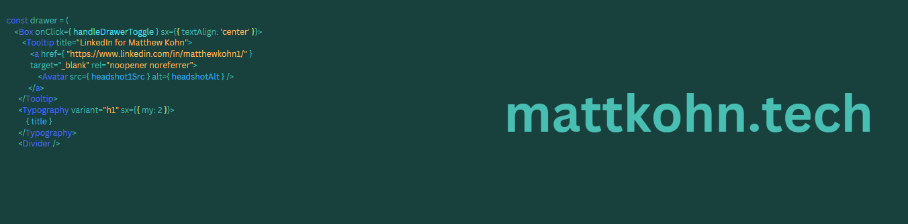

# Hello World 👋
I'm Matt, freelance software engineer from Eagle, Colorado.

Check out my portfolio website at [mattkohn.tech](https://mattkohn.tech), or connect with me on [LinkedIn](https://www.linkedin.com/in/matthewkohn1/).

---

  
  
  
  
  
  
  
  
  
  
  
  
  

---

